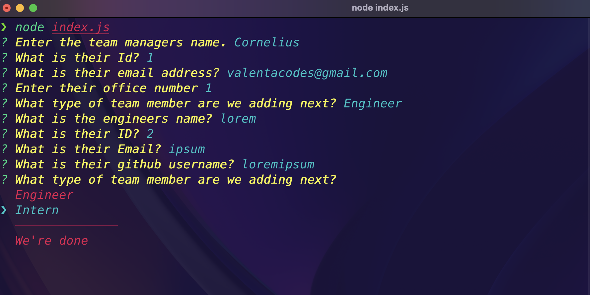

# Team Profiler

<a href="https://choosealicense.com/licenses/mit/">

</a>

## How to use

https://user-images.githubusercontent.com/92850947/211243567-79900538-071c-4a1e-8411-c7b6ed42fcd6.mp4

## *Table of Contents*

- [Description](#description)
- [Tools](#tools)
- [Motivation](#motivation)
- [Installation](#installation)
- [Usage](#usage)
- [Contribution](#contribution)
- [Testing](#testing)
- [License](#license)
- [Screenshots](#screenshots)
- [Questions](#questions)

## **Description**

  A CLI tool that generates a beautiful HTML page with the users team information.

## **Tools**

  Javascript, Node, Inquirer@8.2.4, Jest@29.3.1

## **Motivation**

  I wanted to test my skills in code testing. That way I can produce more efficient code that is less prone to breaking.

## **Installation**
  
- Download zip

## **Usage**

- Navigate to respective folder where files were downloaded

- cd into folder

``` en
npm install 
node index.js
```

- After prompts are answered check the "**dist**" folder for your rendered HTML and CSS files

## **Contribution**

  Contact me

  Information below
  
## **Testing**

- Navigate to <**tests**> folder and run the following commands:

To test the Employee module:

  ```en
  npm test Employee.test.js
  ```

To test the Engineer module:

```en
npm test Engineer.test.js
```

To test the Intern module:

  ```en
  npm test Intern.test.js
  ```

To test the Manager module:

  ```en
  npm test Manager.test.js
  ```

## **Screenshots**

  
  
  
  
  

## **Links**
  
  [Repo](https://github.com/ValentaCodes/Team-Profiler)

## License

  This project is licensed under the terms of the MIT license.

  Detailed information about this license can be found here: [License Info](https://choosealicense.com/licenses/mit)

## Questions

  Any question about this project contact me here:

- [Github](https://github.com/valentacodes)
- <valentacodes@gmail.com>
  
